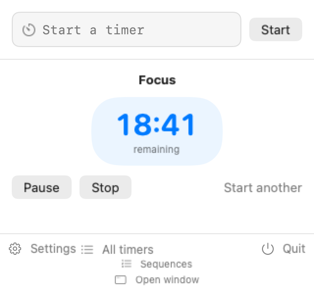
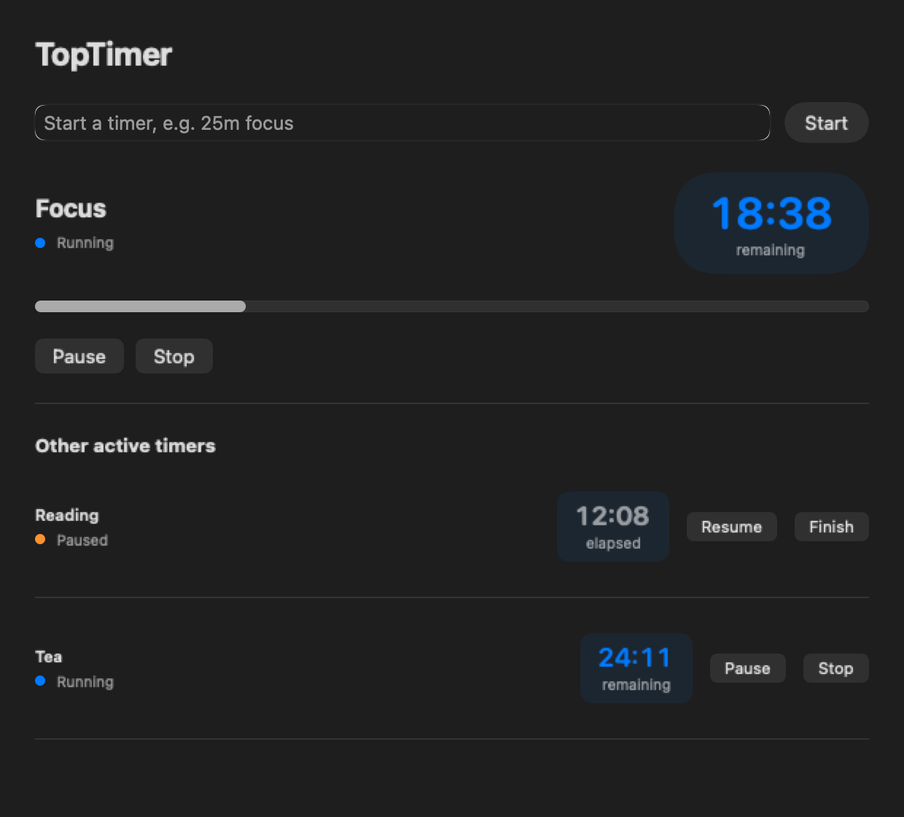
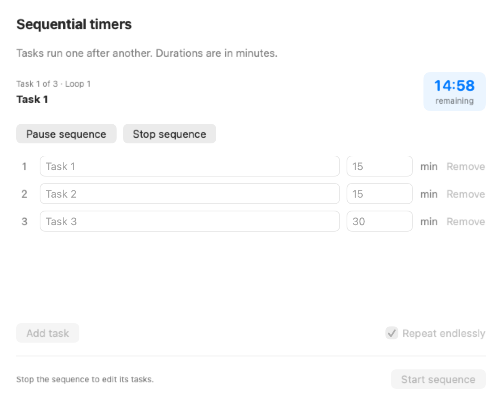

# TopTimer

TopTimer is a native, open-source macOS menu-bar timer for fast countdowns and
stopwatches. It runs offline, has no account, and keeps timer, preset, settings,
sound, and history data on your Mac.

## Features

- Run multiple countdowns and stopwatches; the menu bar prioritizes the running
  countdown due first, or the oldest running stopwatch.
- Add a title, an optional description, and up to 12 tags to each timer.
- Pause, resume, restart, duplicate, edit, delete, acknowledge, and recover timers.
- Repeat by interval, daily time, weekdays, weekly day/time, or selected weekdays.
  Each completion produces at most one successor occurrence.
- Receive completion notifications with **Stop**, **Repeat**, and **Snooze** actions.
- Select built-in or imported sounds and set per-timer playback volume. macOS controls
  notification volume independently; an unavailable custom sound falls back safely.
- Search and filter history, recover soft-deleted entries, view bounded daily/weekly
  reports, and export UTF-8 RFC 4180 CSV.
- Configure global shortcuts, launch at login, clock format, menu-bar display,
  retention, snooze duration, and prevention of idle sleep while timers run.

TopTimer requires macOS 13.5 or later. The local package produced by this repository
is currently Apple silicon (`arm64`) only; no Intel (`x86_64`) binary is claimed.

## Quick syntax

Enter a command in the menu-bar popover and press Return or **Start**:

| Input | Result |
| --- | --- |
| `15m Tea #home` | 15-minute timer titled Tea with the `home` tag |
| `1.5h Deep work` | 90-minute timer |
| `1h 20m` or `60s` | Compound or seconds countdown |
| `1:30:45` | 1 hour, 30 minutes, 45 seconds |
| `@3pm` or `@14:30` | Countdown to the next matching wall-clock time |
| `stopwatch reading #books` | Named stopwatch with the `books` tag |
| blank input + **Start** | Stopwatch starting at `00:00` |

Use the expanded editor to add or change descriptions, tags, recurrence, sound,
and volume. Suggestions are local, keyboard navigable, and bounded to 20 results.
In the popover, arrows select suggestions and Return starts the selection. Space
pauses/resumes when the entry is blank or entirely selected. Escape clears the
entry, then closes the popover when pressed again.

## Sequential timers and cleanup

Every app window has a **Go to** menu for Main window, Timers, Sequences, History,
Reports and Settings. Timer editing is under a timer’s **Actions → Edit**; shortcut
capture is under **Settings → Change…**.

Open **Sequences** from the menu-bar popover or **Go to** menu. The initial tasks are
15 minutes Task 1, 15 minutes Task 2, and 30 minutes Task 3. Edit their names or
minutes, add/remove rows, keep **Repeat endlessly** selected, and choose **Start
sequence**. Only the current task runs. Pause/Resume and Stop control the sequence.
Each completed step goes to history; the saved sequence resumes on relaunch.
Keep TopTimer running for automatic transitions. After quitting or a delayed
wake-up, the next task starts when the app resumes.

Use **Remove** beside a saved suggestion or **Clear saved suggestions** beneath
them. Built-in example commands appear when there are no saved suggestions.
In **All timers**, **Delete all timers** removes every timer while preserving
history and suggestions. **Clear everything…** also removes history, deleted
records, saved suggestions and the saved sequence; app settings and imported
sounds stay. Both bulk actions ask for confirmation.

## Privacy

TopTimer has no telemetry, analytics, account, cloud sync, or network feature.
Its Core Data store and imported sounds stay under the current user's Library.
Logs intentionally omit timer titles, descriptions, tags, exported rows, and file
contents. CSV files contain the history fields you choose to export, so handle them
as personal data.

## Build and test

Install Xcode with the Swift 6 toolchain, then run from the repository root:

```bash
swift test
swift build -c release -Xswiftc -warnings-as-errors
```

Create and verify an ad-hoc-signed local app bundle:

```bash
bash scripts/package-app.sh
bash scripts/verify-app.sh build/TopTimer.app
```

Both scripts resolve the repository independently, so they can be invoked from any
working directory. SwiftPM writes compiler intermediates and products under `.build`.
The packaging script publishes, replaces, and removes only the final
`build/TopTimer.app` bundle; its generated candidate uses a bounded temporary child
inside `build` and is removed after publishing or failure.

## Install and uninstall

Install the verified local bundle:

```bash
ditto build/TopTimer.app /Applications/TopTimer.app
open -a /Applications/TopTimer.app
```

Before replacing an existing installation, quit TopTimer and move the exact
`/Applications/TopTimer.app` bundle to the Trash. To uninstall, quit the app, move
that same exact bundle to the Trash, then optionally remove TopTimer's data from
`~/Library/Application Support/TopTimer` and its preferences only if you do not want
to retain timer history or settings.

## GitHub remote setup

This repository is intentionally delivered without a remote. After creating an
empty GitHub repository yourself, connect and publish it explicitly:

```bash
git remote add origin git@github.com:YOUR-ACCOUNT/TopTimer.git
git remote -v
git push -u origin main
```

Review the destination and repository visibility before pushing. No GitHub
repository or remote is created by the packaging scripts.

## Signing and distribution

The local package uses an ad-hoc signature. It is suitable for local testing but is
not Developer ID signed or notarized. Public GitHub binaries and Mac App Store
distribution require the owner's Apple Developer identity, hardened-runtime and
entitlement review, archive signing, notarization, and release workflow. Those steps
are intentionally outside this repository's local packaging command.

## Screenshots

Native light and dark previews use isolated, synthetic timer data.







See the [full screen gallery and button verification](docs/screenshots/2026-09-30/README.md).

TopTimer is available under the [MIT License](LICENSE).
